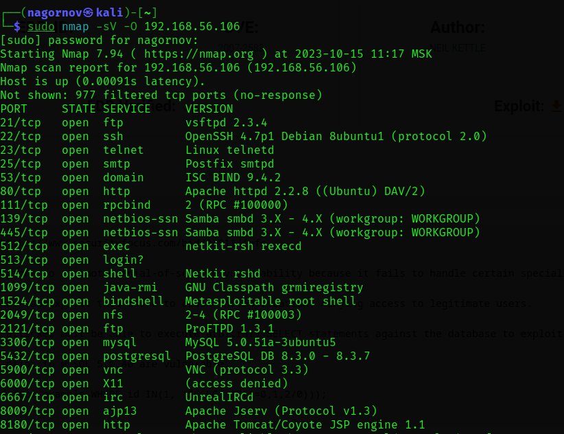

# Домашнее задание к занятию "Уязвимости и атаки на информационные системы" - `Нагорнов Антон Алексеевич`

### Задание 1

Разрешенные службы описаны в столбце SERVICE  

Найденные уязвимости:  
https://www.exploit-db.com/exploits/30020  
https://www.exploit-db.com/exploits/16922  
https://www.exploit-db.com/exploits/17491  

### Задание 2

